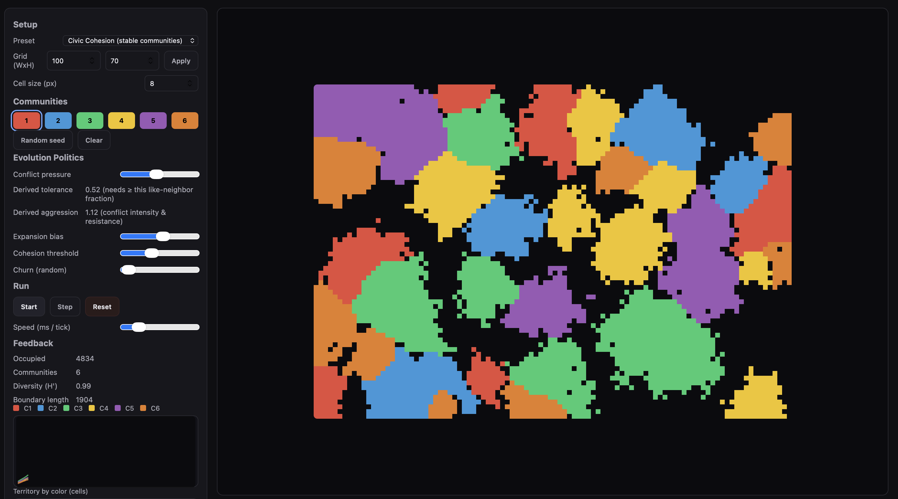

Societies Simulator

A behavioral simulator designed to model how different communities interact and conflict based on adjustable parameters. The goal is to identify the equilibrium point where diverse groups can achieve peaceful coexistence.
Core Concept

This project uses a grid-based sandbox to simulate evolution scenarios. By adjusting environmental and behavioral pressures, users can observe how societies form stable borders or collapse into conflict.

The simulation derives two critical behavioral metrics from a single Conflict Pressure slider:

    Tolerance: The threshold of different neighbors an agent can withstand before decaying or flipping.

    Aggression: The intensity of conflict and the resistance to being overtaken by rival groups.

Features

    Real-time Interaction: Click and drag to seed communities or erase them directly on the grid.

    Dynamic Analytics: Track diversity, total territory, and event spikes via live sparklines.

    Presets: Includes configurations for Civic Cohesion, Territory Wars, and Schelling-style segregation.

Parameters

    Expansion Bias: Speed of community spread into empty space.

    Cohesion Threshold: Minimum same-neighbor count required to prevent decay.

    Churn: Level of random entropy within the population.

Getting Started

    Open index.html in a web browser.

    Use the Random Seed button or paint societies manually.

    Adjust Conflict Pressure to observe changes in stability.

Regarding the image, it should be placed inside a folder named /assets or /img to maintain a clean root directory.